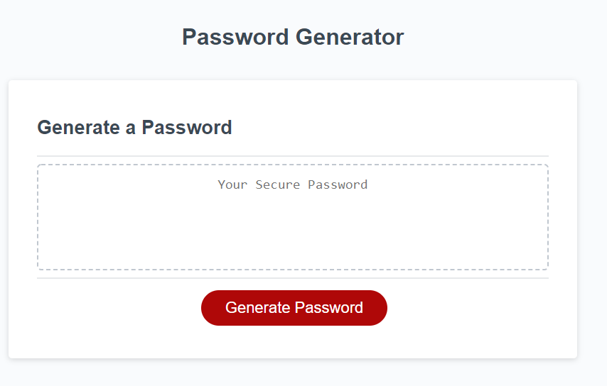

# Password-Generator

Password security is very important for keeping both personal and buisness data secure when using the internet. Randomized passwords are much harder to crack than more predictable passwords created by a user. This program allows users to specifiy criteria for the type of characters used to create a randomized password. These character options include lowercase, uppercase, numbers and special characters. The password length is also selected by the user but is required to be between 8 and 128 characters.

Tools used:
1. JavaScript
2. HTML
3. CSS

https://heathw24.github.io/Password-Generator/

